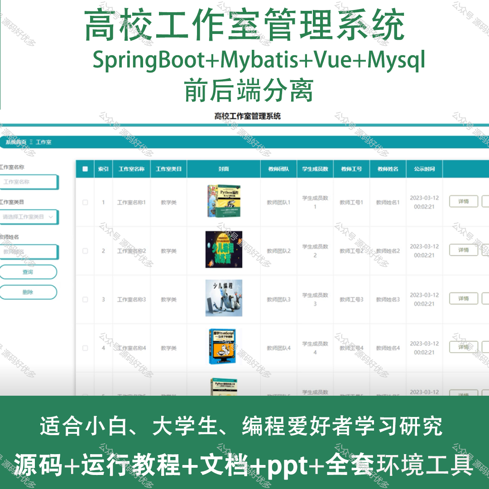
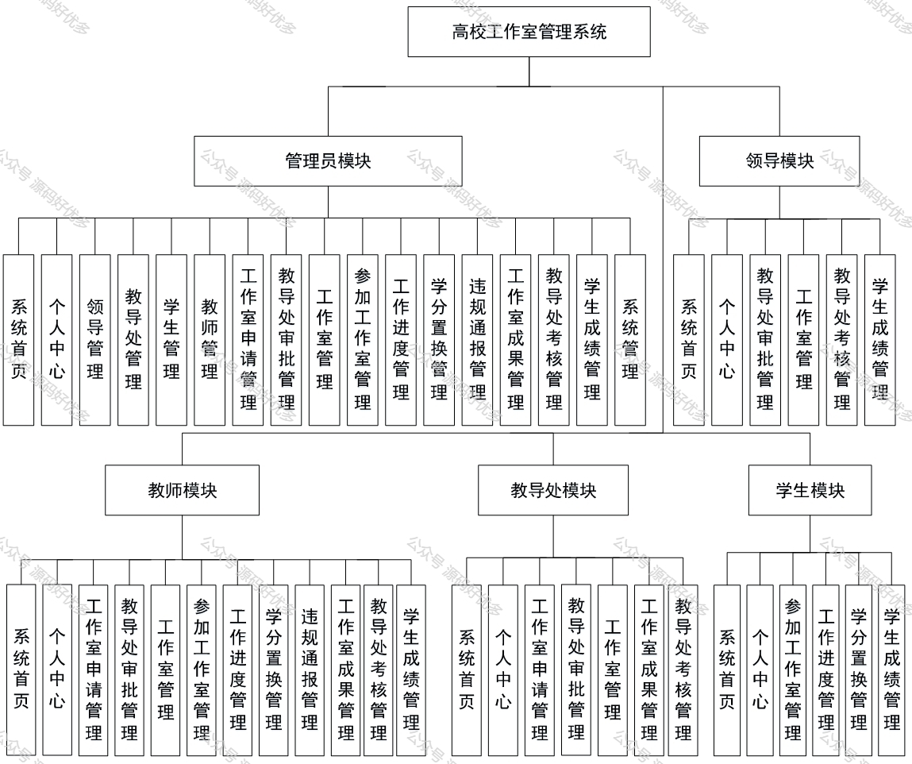
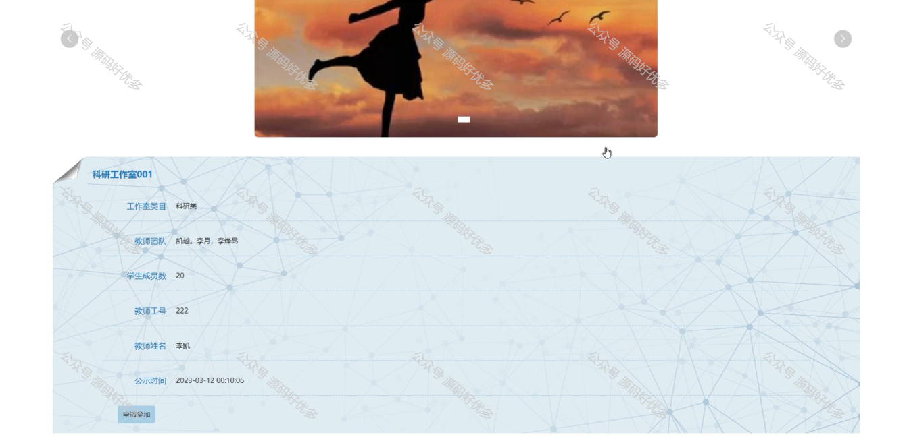
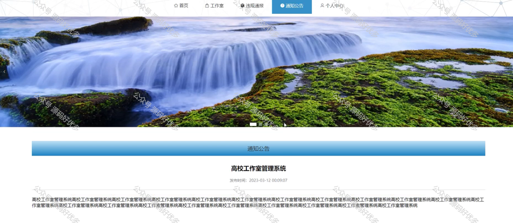
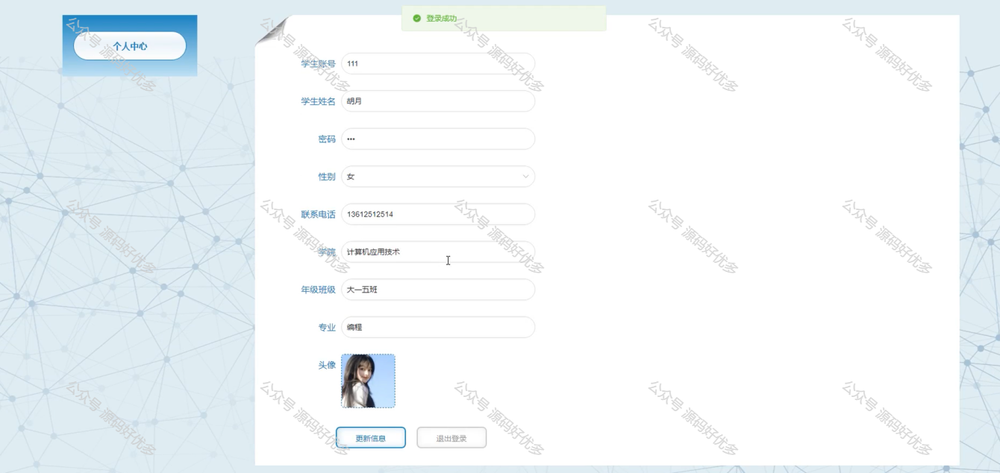
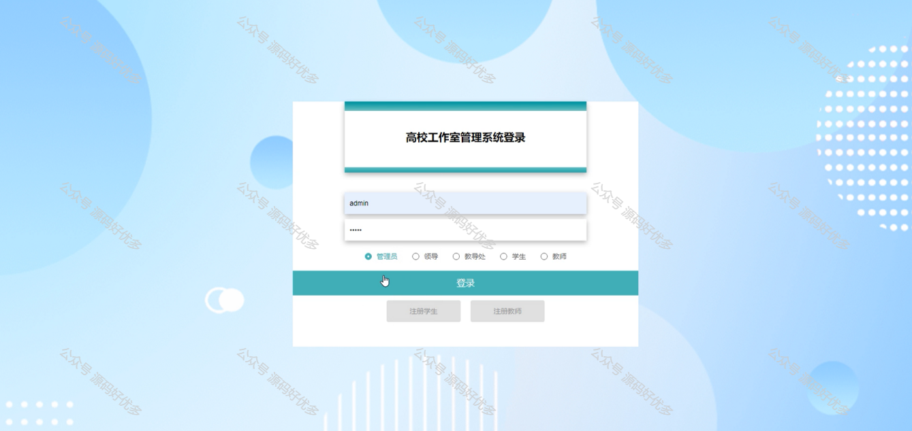
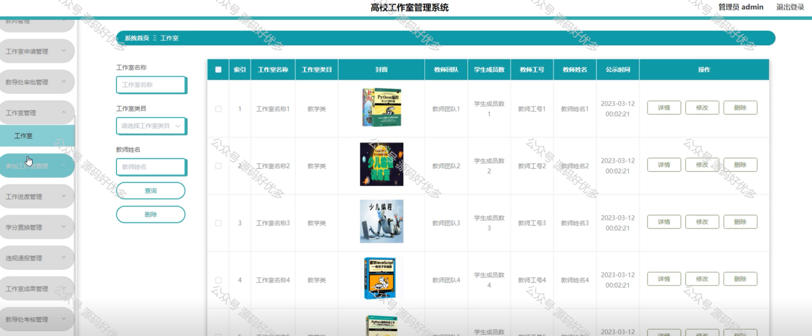
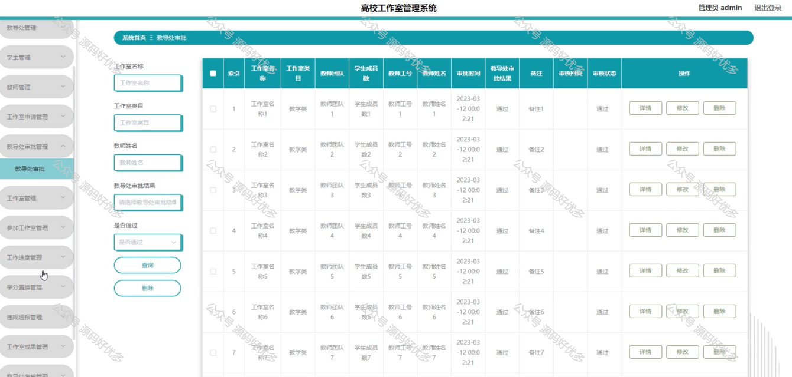
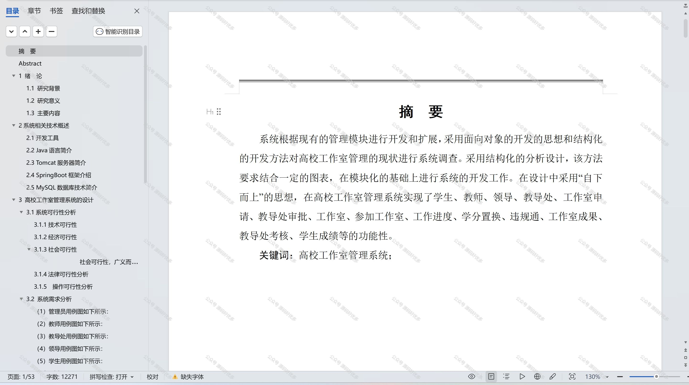

 
## 查看主页获取源码

### 一、作品包含

源码+数据库+设计文档万字+PPT+全套环境和工具资源+部署教程

### 二、项目技术

前端技术：Html、Css、Js、Vue、Element-ui

数据库：MySQL

后端技术：Java、Spring Boot、MyBatis

  

### 三、运行环境

开发工具：IDEA/eclipse

数据库：MySQL5.7

数据库管理工具：Navicat10以上版本

环境配置软件： JDK1.8+Maven3.6.3

前端Nodejs：14

### 四、项目介绍
项目编号：springbootA162

高校工作室管理系统的背景在于应对高校内工作室资源管理复杂、信息更新频繁、资源利用率不高等问题。随着高等教育的发展，高校工作室作为教学、科研、创作的重要场所，其管理需求日益增长。传统的手工管理方式已无法满足高效、精确的管理要求，因此，开发一套集成化、智能化的工作室管理系统，对于优化资源配置、提高管理效率、促进教学科研活动的有序开展具有重要意义。

系统分为管理员、领导、教导、教师、学生
管理员的功能：系统首页、个人中心、领导管理、教导处管理、学生管理、教师管理、工作室申请管理、教导处审批管理、工作室管理、参加工作室管理、工作进度管理、学分置换管理、违规通报管理、工作室成果管理、教导处考核管理、学生成绩管理、系统管理。
领导的功能：系统首页、个人中心、教导处审批管理、工作室管理、教导处考核管理、学生成绩管理。
教导的功能：系统首页、个人中心、工作室申请管理、教导处审批管理、工作室管理、工作室成果管理、教导处考核管理。
教师的功能：系统首页、个人中心、工作室申请管理、教导处审批管理、工作室管理、参加工作室管理、工作进度管理、学分置换管理、违规通报管理、工作室成果管理、教导处考核管理、学生成绩管理。
学生的功能：系统首页、个人中心、参加工作室管理、工作进度管理、学分置换管理、学生成绩管理。

### 五、运行截图

  
